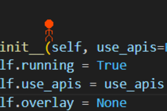

# Animator-vs-Animation-IRL

A 24 hour hackathon project where a stickman is put on a transparent window on top of the screen and can collide with objects that are on your screen like apps and windows. This is done by converting the pixels on the screen to a collision map: pixels similar to the most common background color are treated as background while other pixels are objects that can be collided with. The stickman can punch things which causes the mouse to move there, click it, and move back very fast. Every once in a while, the Google Gemini API makes a snarky comment about a screenshot of the screen. This comment is read aloud by ElevenLabs.

## Features
- 🎮 Stickman with physics-based movement (walk, jump, fly)
- 💥 Punch attacks that interact with screen elements via mouse clicks
- ⚡ Kamehameha energy blast attack (voice-activated or keyboard)
- 🎤 Voice detection for "Hame" command to trigger Kamehameha
- 🗣️ AI-powered snarky commentary via Google Gemini
- 🔊 Text-to-speech via ElevenLabs with streaming audio
- 🎯 Real-time collision detection with screen pixels
- 🎨 background color detection for collision mapping

## Installation

###  Run from Source
1. **Clone the repository:**
   ```bash
   git clone <repository-url>
   cd Animator-vs-Animation-IRL
   ```

2. **Install Python dependencies:**
   ```bash
   pip install -r requirements.txt

3. **Set up API keys:**
   - Create a `.env` file in the project root
   - Add your API keys:
     ```
     ELEVENLABS_API_KEY=your_elevenlabs_key_here
     GOOGLE_API_KEY=your_google_genai_key_here
     ```z

4. **Run the application:**
   ```bash
   python App.py
   ```

## Controls

### Keyboard Controls
| Key | Action |
|-----|--------|
| `J` | Move left |
| `L` | Move right |
| `I` | Jump (or move up when flying) |
| `K` | Move down (when flying) |
| `S` | Punch |
| `E` | Toggle flying mode ON/OFF |
| `D` | Turn flying mode OFF |
| `R` | Kamehameha attack |
| `A` | Teleport to mouse cursor |
| `G` | Re-detect background color |

### Voice Controls
- **Say "Hame"** - Triggers Kamehameha blast
- **Loud sound** - Toggles flying mode

## Project Structure

```
Animator-vs-Animation-IRL/
├── App.py                  # Main application entry point
├── stickman.py             # Stickman physics and controls
├── overlay.py              # Transparent window overlay
├── screen_read.py          # Screen capture and collision detection
├── sound.py                # Sound playback system
├── speech.py               # Text-to-speech via ElevenLabs
├── gemini.py               # AI commentary via Google Gemini
├── voice_detect.py         # Voice command detection
├── requirements.txt        # Python dependencies
├── Test.py                 # Testing utilities
└── assets/
    ├── sprites/            # Stickman animation frames
    └── sounds/             # Sound effects
```

## Technical Details

- **Display:** Transparent PyQt6 overlay at 60 FPS
- **Collision Detection:** Screen pixels sampled at 5 FPS, converted to collision map
- **Physics:** Custom 2D physics with gravity, jump, and flying modes
- **Voice Recognition:** Google Speech Recognition for "Hame" detection
- **Audio:** Pygame mixer for sound effects, ElevenLabs for TTS
- **AI Commentary:** Google Gemini 3 Flash for screen analysis

## Configuration

Edit these constants in the respective files to customize behavior:

**stickman.py:**
- `TARGET_FPS` - Animation frame rate (default: 60)
- `COLLISION_MAP_FPS` - Collision detection rate (default: 5)
- `ENABLE_E_FOR_FLYING` - Enable/disable flying (default: True)
- `ENABLE_R_FOR_KAMEHAMEHA` - Enable/disable Kamehameha (default: True)

## Troubleshooting

**Stickman falls through everything:**
- Press `G` to re-detect the background color
- Ensure your screen has consistent background colors

**Voice commands not working:**
- Check your microphone permissions
- Ensure microphone is set as default recording device
- Voice detection runs in background thread automatically

**No AI comments:**
- Verify you have a valid Google API key set up
- The API key should be in environment variable `GOOGLE_API_KEY`
- Check internet connection
- Review terminal for API errors

**Sounds not playing:**
- Ensure `assets/sounds/` folder exists
- Check that sound files are in correct format (WAV/MP3)
- Verify pygame mixer initialization

**Executable won't run:**
- Windows Defender may block on first run (normal behavior)
- Right-click > Properties > Unblock (if needed)
- Run as Administrator if permission issues occur

## Credits

Based off of the viral video by Alan Becker: Animator vs. Animation

stickman animation based off of the one by Angelina at https://www.pngitem.com/middle/ThbJJm_stickman-fight-sprite-sheet-hd-png-download/

walking sound effect by freesound_community at https://pixabay.com/users/freesound_community-46691455/ on pixabay

Fire Crackling Sounds sound effect by DRAGON-STUDIO at https://pixabay.com/sound-effects/nature-fire-crackling-sounds-427410/ on pixabay

**Animation:**
- Stickman sprites based on work by Angelina at [PNG Item](https://www.pngitem.com/middle/ThbJJm_stickman-fight-sprite-sheet-hd-png-download/)

**Sound Effects:**
- Walking sound by freesound_community on [Pixabay](https://pixabay.com/users/freesound_community-46691455/)
- Fire/Aura sound by DRAGON-STUDIO - [Fire Crackling Sounds](https://pixabay.com/sound-effects/nature-fire-crackling-sounds-427410/) on Pixabay

**APIs:**
- [Google Gemini](https://ai.google.dev/) - AI commentary
- [ElevenLabs](https://elevenlabs.io/) - Text-to-speech

## License

This is a hackathon project. Feel free to use and modify as needed.

## Future Ideas

- [ ] Add more attack animations
- [ ] Multiple stickmen characters
- [ ] Save/load stickman position
- [ ] Custom keybindings configuration
- [ ] Health system and damage effects
- [ ] Multiplayer support
- [ ] More voice commands
- [ ] Screen recording mode
